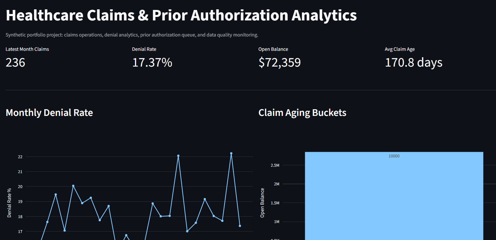
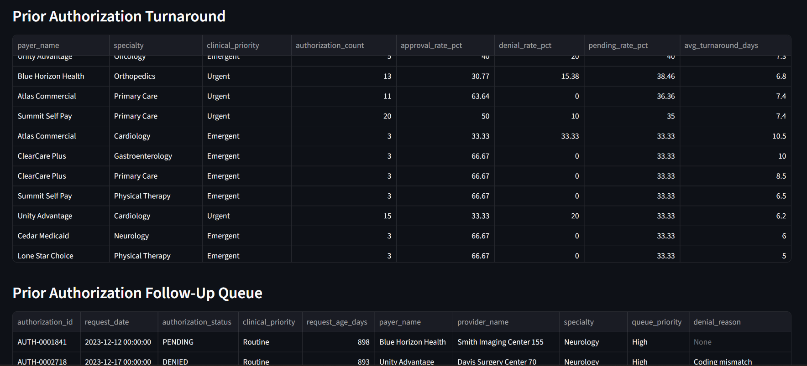
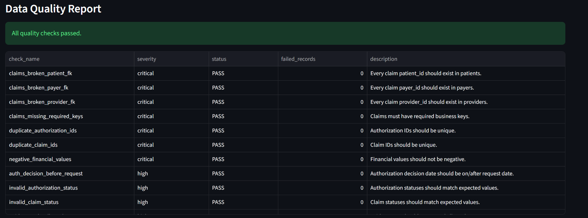

# Healthcare Claims & Prior Authorization Analytics Platform

A portfolio-ready healthcare analytics project built for Data Analyst / Analytics Engineer roles at healthcare, product, and GovTech companies.

This project uses **synthetic healthcare data** to simulate the type of work an analyst would perform for claims operations, prior authorization monitoring, payer/provider performance, and client-facing reporting.

> Built as an original project structure. It is safe to use as a personal GitHub portfolio project after you run it, review the code, and customize the README/screenshots with your own results.

---

## Why this project matters

Healthcare analytics roles often ask for more than dashboarding. They expect analysts to:

- Write reliable SQL for operational and executive metrics.
- Validate messy data before reporting it.
- Translate raw claims/authorization data into business-ready marts.
- Explain metric changes to non-technical stakeholders.
- Build repeatable reporting workflows instead of one-off analysis.

This project demonstrates those skills through a reproducible pipeline.

---

## Business problem

A health-tech operations team needs visibility into:

1. Which payers have the highest denial rates?
2. Which providers have unusually high claim volume or unpaid balances?
3. How long prior authorizations take from submission to decision?
4. Which claims should be prioritized due to aging, denial, or high balance?
5. Are reports trustworthy based on data quality checks?

---

## Tech stack

- **Python**: synthetic data generation and pipeline orchestration
- **DuckDB**: local analytical warehouse
- **SQL**: staging, dimensional modeling, marts, KPI tables
- **pandas / NumPy**: data generation and quality reporting
- **Streamlit + Plotly**: interactive dashboard
- **pytest**: testable quality checks

This stack is intentionally lightweight so recruiters/interviewers can run it locally without needing paid cloud tools.

---

## Repository structure

```text
healthcare-claims-prior-auth-analytics/
├── app/
│   └── streamlit_app.py
├── data/
│   ├── raw/                 # generated synthetic CSVs
│   └── processed/           # exported quality report
├── docs/
│   └── INTERVIEW_NOTES.md
├── sql/
│   ├── 01_staging.sql
│   ├── 02_marts.sql
│   └── 03_business_metrics.sql
├── src/
│   ├── config.py
│   ├── data_quality.py
│   ├── generate_synthetic_data.py
│   └── run_pipeline.py
├── tests/
│   └── test_data_quality.py
├── .gitignore
├── requirements.txt
└── README.md
```

---

## How to run

### 1. Create a virtual environment

```bash
python -m venv .venv
source .venv/bin/activate      # Mac/Linux
# .venv\Scripts\activate     # Windows PowerShell
```

### 2. Install dependencies

```bash
pip install -r requirements.txt
```

### 3. Generate synthetic data

```bash
python src/generate_synthetic_data.py
```

### 4. Build the local analytics warehouse

```bash
python src/run_pipeline.py
```

### 5. Run tests

```bash
pytest
```

### 6. Launch dashboard

```bash
streamlit run app/streamlit_app.py
```

---
## Dashboard Preview







## Synthetic data model

The project creates six synthetic raw tables:

| Table | Description |
|---|---|
| `patients.csv` | Synthetic patient demographics and location fields |
| `providers.csv` | Provider specialty, facility type, and region |
| `payers.csv` | Commercial, Medicare Advantage, Medicaid, and self-pay plans |
| `encounters.csv` | Patient visits connected to providers |
| `authorizations.csv` | Prior authorization request, decision, turnaround time, and status |
| `claims.csv` | Claim status, charges, payments, denial reason, service date, and balance |

No real patient data is used.

---

## Analytics marts created

| Mart | Purpose |
|---|---|
| `mart_monthly_claim_kpis` | Monthly claim count, denial rate, paid rate, gross charges, allowed amount, paid amount |
| `mart_payer_performance` | Payer-level denial rate, balance, average payment, and claim aging |
| `mart_provider_performance` | Provider-level claim volume, denial rate, paid amount, and average claim age |
| `mart_authorization_turnaround` | Authorization approval/denial rates and turnaround time by payer/specialty |
| `mart_prior_auth_queue` | Operational queue for pending/denied/high-risk authorization cases |
| `mart_claim_aging_buckets` | 0-30, 31-60, 61-90, and 90+ day unpaid claim buckets |

---

## Data quality checks

The pipeline validates:

- Duplicate primary keys
- Missing required IDs
- Broken foreign keys
- Invalid claim statuses
- Invalid authorization statuses
- Negative charges/payments/balances
- Claim service dates after submission dates
- Authorization decision dates before request dates
- Paid amount greater than allowed amount
- Missing denial reason on denied claims

Results are written to:

```text
data/processed/data_quality_report.csv
```

and also stored inside DuckDB as:

```sql
mart_data_quality_checks
```

---

## Example resume bullets

After customizing and running this project, you can use bullets like:

- Built an end-to-end healthcare analytics platform using synthetic claims, encounters, payer, provider, and prior authorization data to monitor denial rates, claim aging, authorization turnaround, and unpaid balances.
- Modeled raw healthcare CSVs into staging tables, dimensions, facts, and business-ready marts using SQL and DuckDB.
- Developed data quality checks for duplicate keys, broken foreign keys, invalid statuses, missing denial reasons, negative financial values, and inconsistent authorization dates.
- Created an interactive Streamlit dashboard with payer/provider drilldowns, denial trends, authorization queue monitoring, aging buckets, and monthly KPI tracking.
- Documented business definitions, assumptions, and metric logic to support reproducible stakeholder reporting.

---

## How to make this truly yours

Before publishing to GitHub:

1. Run the pipeline locally.
2. Add your own screenshots from Streamlit.
3. Modify at least 3 KPIs or business rules.
4. Add a short `insights.md` file with your findings.
5. Push commits gradually instead of uploading everything in one commit.
6. Be ready to explain every SQL model and quality check.

---

## Interview story

**Situation:** Healthcare operations teams need reliable reporting on claims and authorizations.

**Task:** Build a reproducible analytics workflow from raw synthetic data to business-ready metrics.

**Action:** Generated synthetic healthcare data, modeled it in SQL, created quality checks, and built an interactive dashboard.

**Result:** Produced a portfolio project showing SQL modeling, healthcare metrics, data validation, documentation, and stakeholder-friendly reporting.
